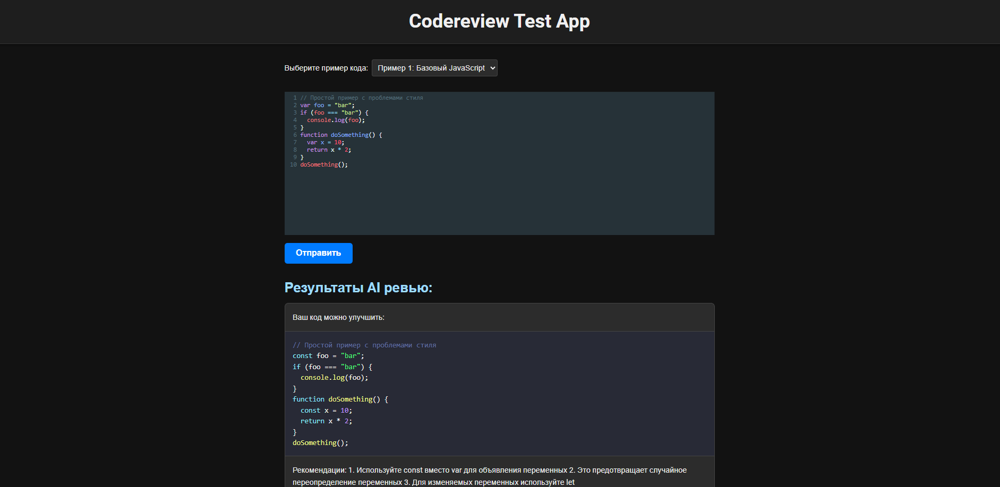
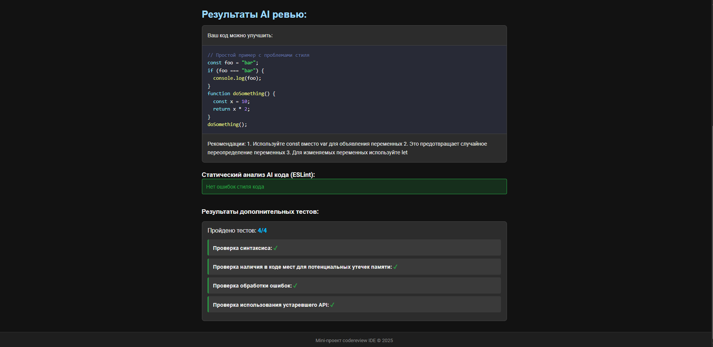
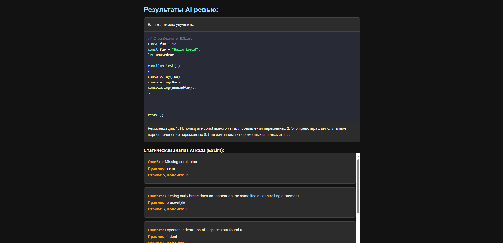

# 🔍 Codereview IDE



## 🌟 Особенности

-   🔎 Встроенный линтинг для анализа стиля кода
-   🧪 Автоматические тесты для выявления проблем
-   📝 Редактор кода с подсветкой синтаксиса
-   🔄 Готовые примеры для быстрого начала работы
-   📊 Наглядное отображение результатов анализа

## 🚀 Установка и запуск

1. Клонируйте репозиторий:

```bash
git clone https://github.com/Hamptooon/codereview-test-app.git
```

2. Установите зависимости:

```bash
npm install
```

3. Запустите приложение:

```bash
npm run start
```

## 🖥️ Скриншоты

| Пример результата анализа 1                                 | Пример результата анализа 2                                 |
| ----------------------------------------------------------- | ----------------------------------------------------------- |
|  |  |

## 🧩 Структура проекта

Основные компоненты:

-   `App` - корневой компонент приложения
-   `CodeForm` - форма с редактором кода
-   `CodeSelector` - выбор примеров кода
-   `AiResponseDisplay` - отображение ревью от ИИ
-   `LintResultsDisplay` - результаты линтинга
-   `TestResultsDisplay` - результаты тестирования

## 🛠️ Технологии

-   React и TypeScript
-   ESLint для статического анализа
-   CodeMirror для редактирования кода
-   SCSS модули для стилизации
-   Синтаксическая подсветка кода
-   Интеграция с ИИ для умного ревью (Исполбзуются мок данные)
